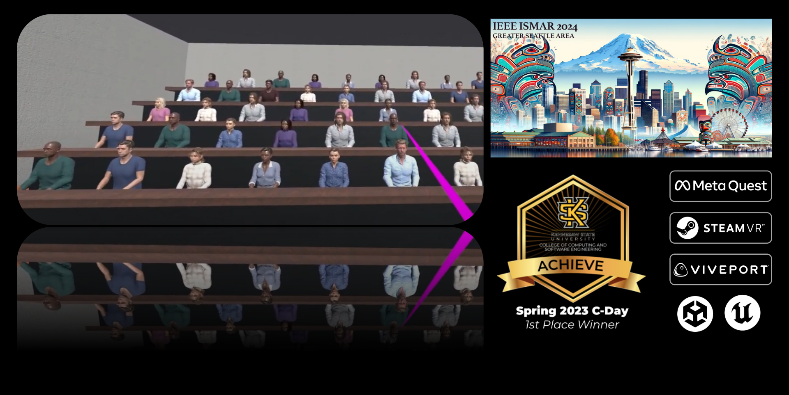

# Eye-Tracking-VR-ISMAR-2024

Due to the nature of our research, the project files are private at this time.

## Project description
A Unity-based VR classroom environment for HTC Vive with integrated eye-tracking for interaction analysis that was awarded 1st place graduate research in the biannual university computing showcase, C-Day Spring 2023. Conducted user studies and collected real-time player data from 24 participants, leading to co-authorship of a publication presented at IEEE ISMAR 2024, one of the leading international conferences in VR/MR/AR. Currently remastering the prototype with Unreal Engine for Meta Quest with enhanced rendering capabilities and performance. 

### Made with ~
C#, Unity (HTC Vive version); C++, Unreal Engine (Remastered version for Meta Quest).

### Links ~
* <a href="https://ieeexplore.ieee.org/document/10765431">IEEE ISMAR 2024 publication</a>
* Demo videos available upon request.
